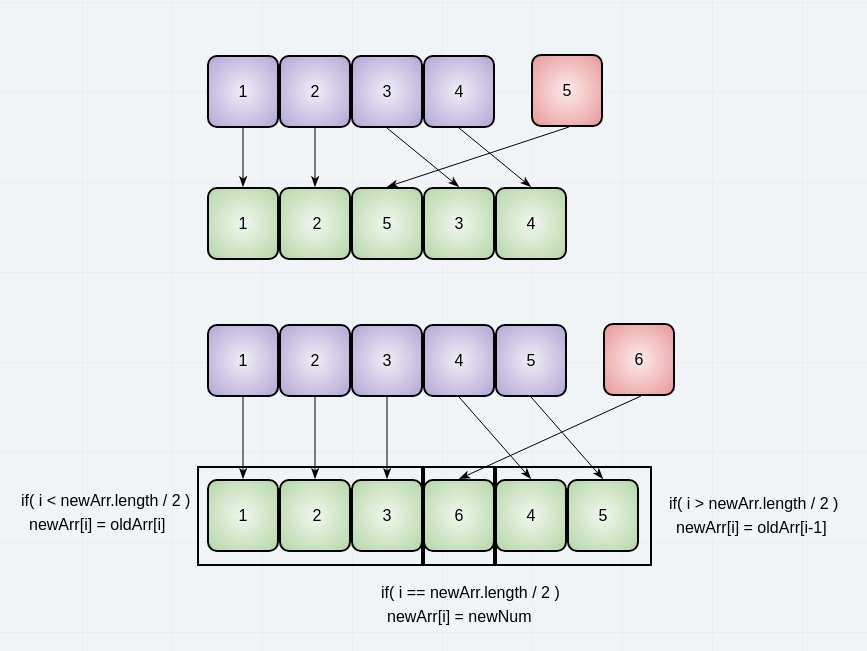

# Insert Shift Array

## Feature Task

Without utilizing any of the built-in methods available in C#, 
write a function called `insertShiftArray` which takes in an array 
and the value to be added to the array.

Return an array with the new value added at the middle index.

