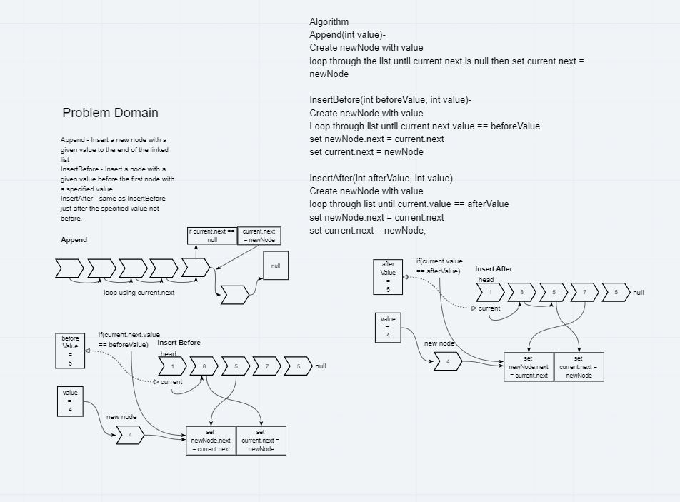
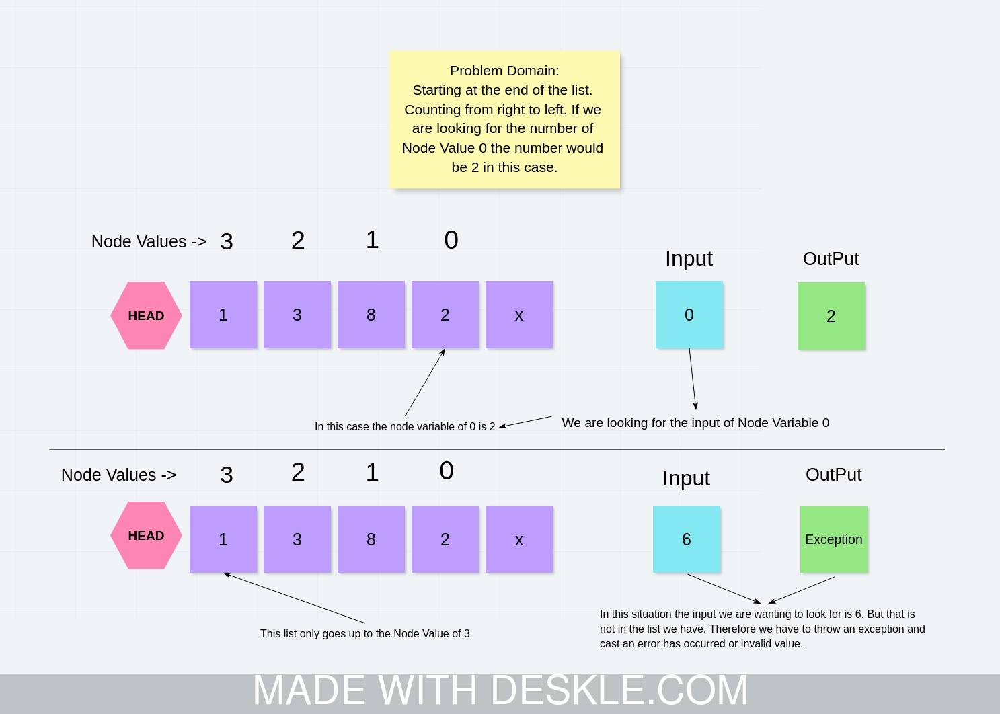

# Data Structures And Algorithms

## Linked Lists

### Challenge Description

`Append` - Insert a new node with a given value to the end of the linked list

`InsertBefore` - Insert a node with a given value before the first node with a specified value

`InsertAfter` - same as InsertBefore just after the specified value not before.

### Approach & Efficiency

`Append`(int value)

* Create newNode with value

* loop through the list until current.next is null then set current.next = newNode

`InsertBefore`(int beforeValue, int value)

* Create newNode with value

* Loop through list until current.next.value == beforeValue

* set newNode.next = current.next

* set current.next = newNode

`InsertAfter`(int afterValue, int value)-

* Create newNode with value

* loop through list until current.value == afterValue

* set newNode.next = current.next

* set current.next = newNode;

### Solution

### White Board

## Kth From The End

Write a method for the `Linked-List` class which takes a number, `k`, as a parameter. Return the node’s value that is `KthFromTheEnd` of the linked list. You have access to the Node class and all the properties on the Linked List class as well as the methods created in previous challenges.

### Challenge Description

<!-- Description of the challenge -->

### Approach & Efficiency

<!-- What approach did you take? Why? What is the Big O space/time for this approach? -->

### Solution

### White Board

