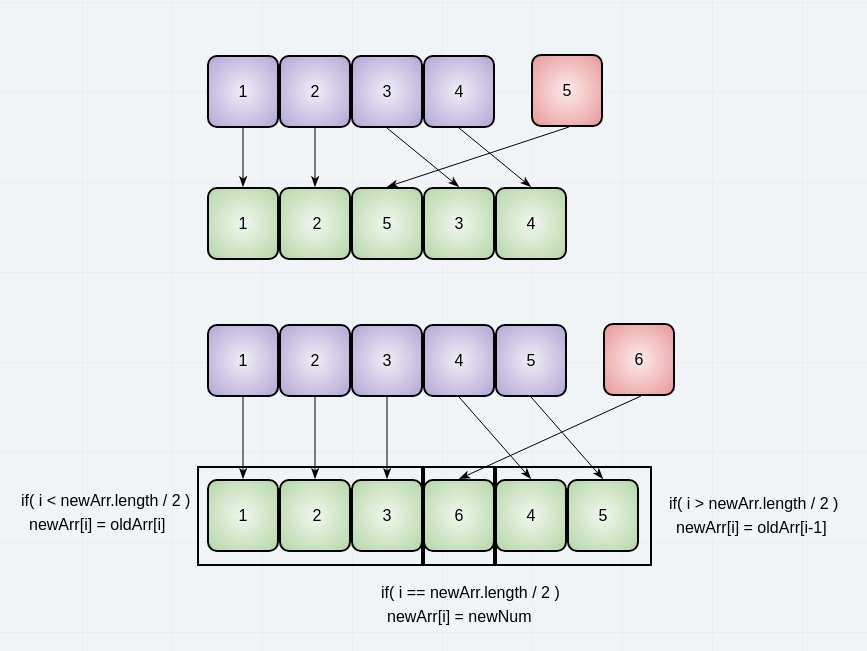
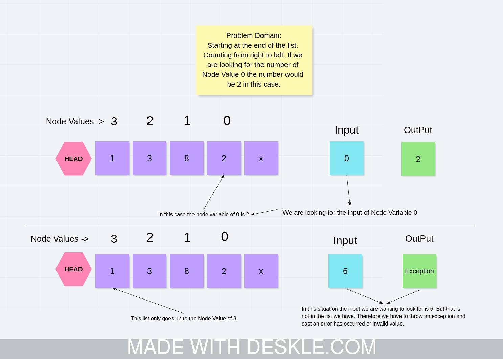
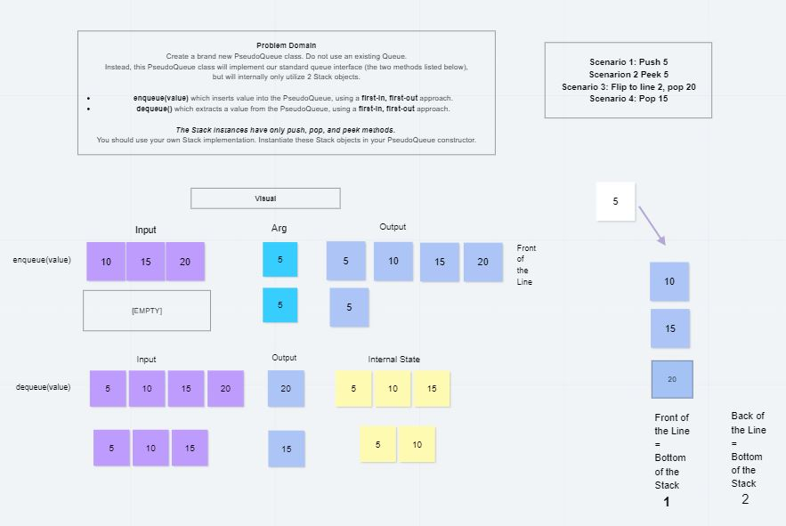
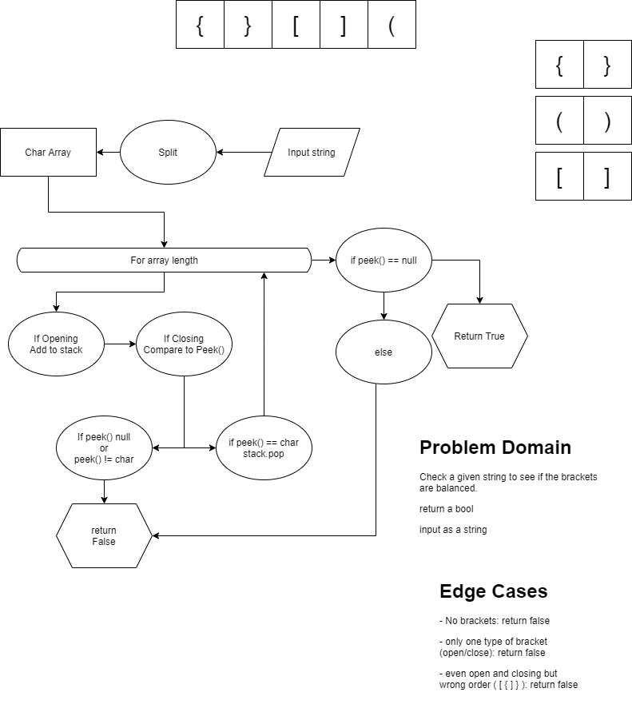
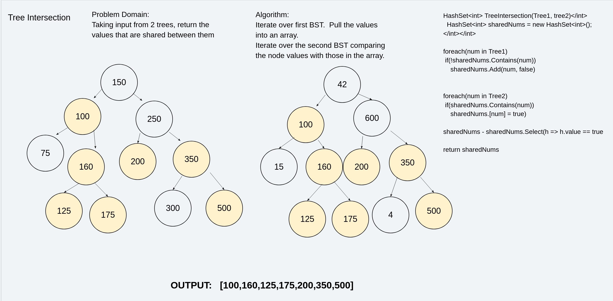
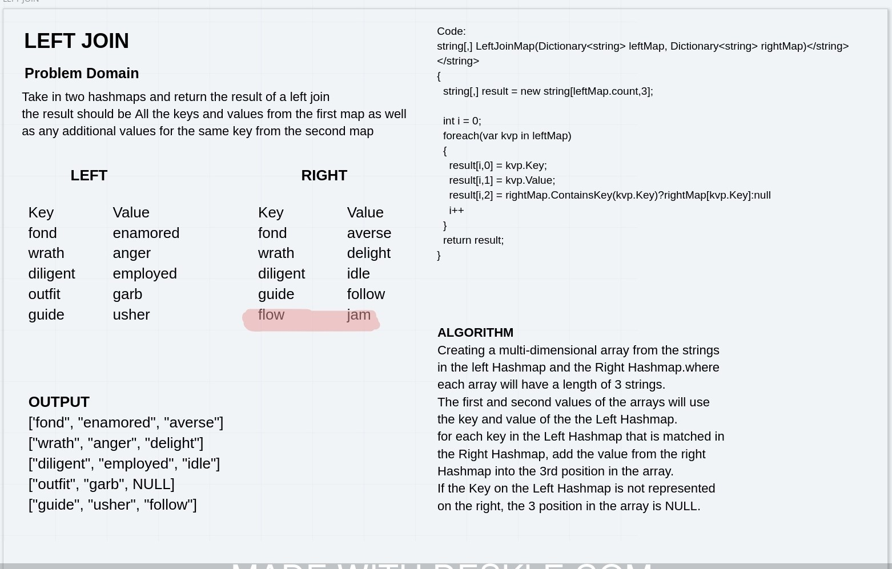
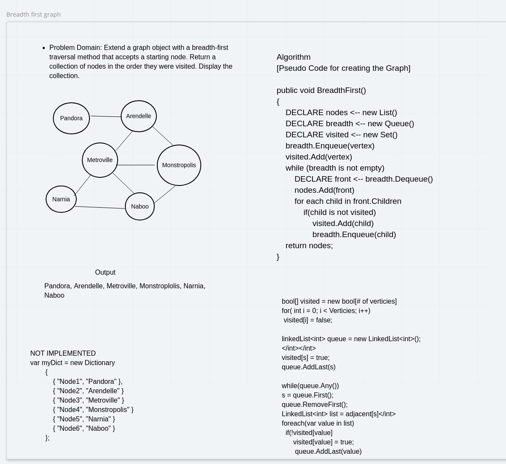
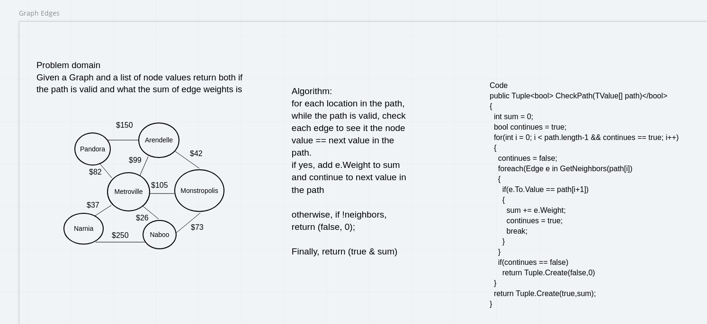

# Data Structure and Algorithms

## Reverse an Array

Write a function called `reverseArray` which takes an array as an argument.
Without utilizing any of the built-in methods available to your language,
return an array with elements in reversed order.

## Insert Shift Array

Without utilizing any of the built-in methods available in C#,
write a function called `insertShiftArray` which takes in an array
and the value to be added to the array.

Return an array with the new value added at the middle index.

## Binary Sort

Search a sorted array for a Key using a Binary Sort.

## Singly Linked List

### Challenge
<!-- Description of the challenge -->

### Approach & Efficiency

<!-- What approach did you take? Why? 
What is the Big O space/time for this approach? -->

### API

Public Classes in Linked Lists.cs include:

| LinkedList | Node Head | Insert | Include| ToSring |

## Insertions

Write the following methods for the Linked List class:

`.append(value)` which adds a new node with the given value to the end of the list
`.insertBefore(value, newVal)` which add a new node with the given newValue immediately before the first value node
`.insertAfter(value, newVal)` which add a new node with the given newValue immediately after the first value node

## Kth From The End

Write a method for the `Linked-List` class which takes a number, `k`, as a parameter. Return the node’s value that is `KthFromTheEnd` of the linked list. You have access to the Node class and all the properties on the Linked List class as well as the methods created in previous challenges.

### Challenge Description

<!-- Description of the challenge -->

### Approach & Efficiency

<!-- What approach did you take? Why? What is the Big O space/time for this approach? -->

### Solution

### White Board

## PseudoQueue Using 2 Stacks

Create a brand new `PseudoQueue` class. Do not use an existing Queue. Instead, this `PseudoQueue` class will implement our standard queue interface (the two methods listed below), but will internally only utilize 2 `Stack` objects. Ensure that you create your class with the following methods:

`enqueue(value)` which inserts value into the PseudoQueue, using a first-in, first-out approach.

`dequeue()` which extracts a value from the PseudoQueue, using a first-in, first-out approach.

The `Stack` instances have only `push`, `pop`, and `peek` methods. You should use your own Stack implementation. Instantiate these Stack objects in your PseudoQueue constructor.

## Example

`enqueue(value)`  
Input [10]->[15]->[20] 
Args 5  
Output [5]->[10]->[15]->[20]  
[Empty Set], 5  
[5] 

`dequeue()` 
Input----------------Output---Internal State
[5]->[10]->[15]->[20]---20-----[5]->[10]->[15])
[5]->[10]->[15]-----15-----[5]->[10]

### Requirements

Ensure your complete solution follows the standard requirements.

Write unit tests.

## FIFO Animal Shelter

## Multi-Bracket Validation

## Trees

Create a Node class that has properties for the value stored in the node, the left child node, and the right child node.

### Challenge

<!-- Description of the challenge -->

### Approach & Efficiency

<!-- What approach did you take? Why? What is the Big O space/time for this approach? -->

### API

<!-- Description of each method publicly available in each of your trees -->

`Node` class that has properties for the value stored in the node, the left child node, and the right child node.

`BinaryTree` class
Define a method for each of the depth first traversals called preOrder, inOrder, and postOrder which returns an array of the values, ordered appropriately.

`BinarySearchTree` class
Define a method named add that accepts a value, and adds a new node with that value in the correct location in the binary search tree.
Define a method named contains that accepts a value, and returns a boolean indicating whether or not the value is in the tree at least once.

## Find Max Value Binary Tree

Write an instance method called `find-maximum-value`.

Without utilizing any of the built-in methods available to your language, return the maximum value stored in the tree. You can assume that the values stored in the Binary Tree will be numeric.

## Breadth Transversal Binary Tree

Write a `breadth first traversal method` which takes a `Binary Tree` as its unique input. 

Without utilizing any of the built-in methods available to your language, traverse the input tree using a Breadth-first approach, and return a `list of the values` in the tree in the order they were encountered.

Beginning at the `root`, `enqueue the root`, check left and right to see if there are children, `enqueue the children`, check left and right to see if they have children, `enqueue the children` until you have `traveresed` the `height` of the tree.

## FizzBuzz Tree

Write a function called `FizzBuzzTree` which takes a `k-ary tree` as an argument.

Without utilizing any of the built-in methods available to your language, determine whether or not the value of each node is divisible by 3, 5 or both. 

Create a new tree with the same structure as the original, but the values modified as follows:

If the value is `divisible by 3`, replace the value with **“Fizz”**

If the value is `divisible by 5`, replace the value with **“Buzz”**

If the value is `divisible by 3 and 5`, replace the value with **“FizzBuzz”**

If the value is not divisible by 3 or 5, simply turn the number into a String.

## HashSet with Repeated Word

## Tree Intersection

## Left Join for 2 Hashmaps

#### PROBLEM DOMAIN

Write a function that `LEFT JOINs` two `hashmaps` into a single data structure.

The result should include all the `keys` and `values` from the first hashmap as well as any additional `values` for the same `key` from the second map

#### ALGORITHM

We solved this by creating a `multi-dimensional array` from the `strings` in the Left Hashmap and the Right Hashmap.where each array has a length of 3 strings.

The first and second `values` of the arrays are filled by the `key` and `value` of the Left Hashmap.

For each `key` in the Left Hashmap that is matched in the Right Hashmap, we added the `value` from the Right Hashmap into the 3rd position in the array.

If the Key on the Left Hashmap is not represented on the right, the 3 position in the array is NULL. 

## BreadthFirstGraph

### Problem Domain:

Extend a `graph object` with a `breadth-first traversal` method that accepts a starting node. Return a collection of nodes in the order they were visited. Display the collection.

### Algorithm

[Pseudo Code for creating the Graph]

`public void BreadthFirst()`

{`DECLARE nodes <-- new List()`  
    `DECLARE breadth <-- new Queue()`  
    `DECLARE visited <-- new Set()`  
    `breadth.Enqueue(vertex)`  
    `visited.Add(vertex)`  
    `while (breadth is not empty)`  
        `DECLARE front <-- breadth.Dequeue()`  
        `nodes.Add(front)`  
        `for each child in front.Children`  
            `if(child is not visited)`  
                `visited.Add(child)`  
                `breadth.Enqueue(child)`  
    `return nodes;`
}

## Get Edge Weight

Write a function based on the specifications shown, which takes in a graph, and an array of city names. Without utilizing any of the built-in methods available to your language, return whether the full trip is possible with direct flights, and how much it would cost.

