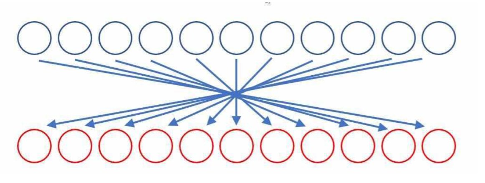

# Data Structure and Algorithms

## Reverse an Array

Write a function called `reverseArray` which takes an array as an argument.
Without utilizing any of the built-in methods available to your language,
return an array with elements in reversed order.

## Insert Shift Array

Without utilizing any of the built-in methods available in C#,
write a function called `insertShiftArray` which takes in an array
and the value to be added to the array.

Return an array with the new value added at the middle index.

## Binary Sort

Search a sorted array for a Key using a Binary Sort.

## Singly Linked List

### Challenge
<!-- Description of the challenge -->

### Approach & Efficiency

<!-- What approach did you take? Why? 
What is the Big O space/time for this approach? -->

### API

Public Classes in Linked Lists.cs include:

| LinkedList | Node Head | Insert | Include| ToSring |

## Insertions

Write the following methods for the Linked List class:

`.append(value)` which adds a new node with the given value to the end of the list
`.insertBefore(value, newVal)` which add a new node with the given newValue immediately before the first value node
`.insertAfter(value, newVal)` which add a new node with the given newValue immediately after the first value node

